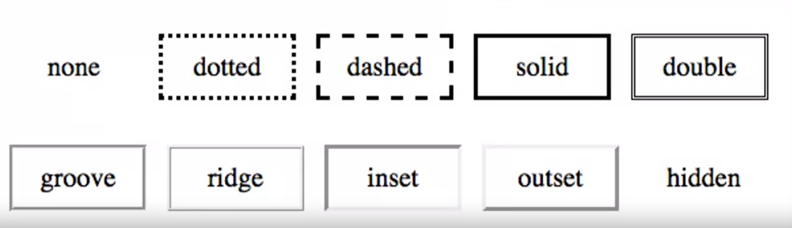
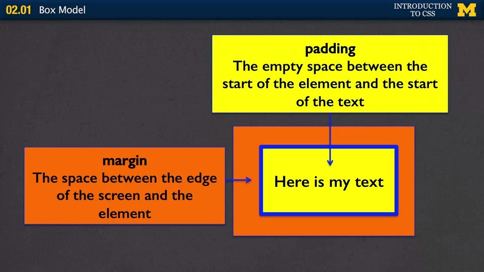

# Box Model

## 1. Height and Width
* The default width of inline elements is the content
* Elements that are not inline can take width and height properties - we saw this in the display lecture.

## 2. Border
* Any element can have a border around it
* border property specifies style, width, and color
* The border style MUST be specified

```
div {
    border: solid 1px #CC00AA;
}
```

### 01. Border-style
* none, dotted, dashed, solid, double, groove, ridge, inset, outset, hidden

<center></center>

### 02. Border width and color
* Width
    * Set in pixels or thin, medium, or large
* Color
    * Name - "blue"
    * RGB - rgb(0,0,255)
    * hex - #0000FF
    * transparent

### 03. Specifying Individual Sides
* All sides: `border-width: 3px;`  
* Top-Bottom and Left-Right sides: `border-width: 3px 10px;`  
* Top, Left-Right, and Bottom sides: `border-width: 3px 10px 20px;`  
* Top, Right, Bottom, and Left sides: `border-width: 3px 10px 20px 1px;`

## 3. Margin
* Margin is additional space <u>_outside_</u> your border - between you and neighbor
* Positive margin
    * element moves right/down
* Negative margin
    * element moves left/upward

## 4. Padding
* Padding is additional space <u>_between_</u> the element and its border.
* Positive padding
    * border moves outward from element
* ~~Negative padding~~ (CSS does not support negative padding)
    * ~~border moves over the element~~

## 5. Margin and Padding
* Neither takes a color (transparent)
    * Margin always the same color as the parent (probably the body of the page)
    * Padding always the same color as the element
* Can also be defined in 1-4 values like border

<center></center>

* <font color="blue">Blue</font> is the border of the element
* <font color="yellow">Yellow</font> is the padding
* <font color="orange">Orange</font> is the margin

## 6. Additive Height and Width

<center></center>

## 7. What is the width and height?
```
div {
    width: 100px;
    height: 50px;
    padding: 10px;
    margin: 5px;
    border: 1px solid black;
}
```
* width = 132 (100 + 10 + 10 + 5 + 5 + 1 + 1)
* height = 82 (50 + 10 + 10 + 5 + 5 + 1 + 1)

## 8. Centering an Element
* To horizontally center an element use:
    - margin: 0 auto;
* But...
    * The element must display: block
    * The element must not float
    * <font color="orange">_The elememt must not have a fixed or absolute position_</font>
    * The element must have a width that is not auto